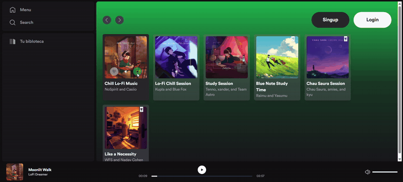

# Spotify Clone with React, Express, and TypeScript

A full-stack Spotify clone application built with modern web technologies. This project demonstrates a complete implementation of a music streaming platform with authentication, playlist management, and real-time music playback.

**Stack:**
- **Frontend:** React, TypeScript, Vite, Tailwind CSS
- **Backend:** Express, TypeScript, Prisma ORM
- **Database:** PostgreSQL
- **Containerization:** Docker & Docker Compose

**Tutorial:** This project is based on [this YouTube video](https://www.youtube.com/watch?v=WRc8lz-bp78)

---

## Demo



> **Note:** The colors in this GIF may appear slightly different from the actual application due to color compression during the MP4 to GIF conversion process. The original interface uses vibrant colors that are better represented in the live application.

---

## Prerequisites

Before you begin, ensure you have the following installed:
- **Node.js** (v14 or higher) - [Download](https://nodejs.org/)
- **npm** or **yarn** - comes with Node.js
- **PostgreSQL** (v12 or higher) - [Download](https://www.postgresql.org/download/) - *Only if not using Docker*
- **Docker & Docker Compose** - [Download](https://www.docker.com/products/docker-desktop) - *Optional, for containerized setup*

## Getting Started

### Clone the Project

To clone this project to your local machine, follow these steps:

1. Open your terminal and run the following command:

```bash
git clone https://github.com/bruaguspons/spotify-clone-react.git
```

2. Change to the project directory:

```bash
cd spotify-clone-react
```

---

### Setting up the Database (Optional - Skip if Using Docker)

If you prefer to run the database locally instead of using Docker, follow these steps:

1. Connect to PostgreSQL:
```bash
psql -U postgres -h localhost -p 5432
```

2. Create the database:
```bash
CREATE DATABASE spotify;
```

---

### Environment Configuration

The project includes three `.env.example` files. Copy each to `.env` and configure as needed:

1. **Root Directory** (`./env.example`)
   - Used for Docker configuration
   - Skip if not using Docker

2. **Frontend** (`./frontend/env.example`)
   - Configure the backend API URL
   - Example: `VITE_API_URL=http://localhost:3000`

3. **Backend** (`./backend/env.example`)
   - Database connection URL
   - Server port
   - JWT secret key for authentication

**Important:** Rename all `env.example` files to `.env` before running the application.

---

## Installation

### Option 1: Local Setup (Without Docker)

#### Frontend

1. Navigate to the frontend directory:
```bash
cd frontend
```

2. Install dependencies and start the development server:
```bash
npm install
npm run dev
```

The frontend will be available at `http://localhost:5173`

#### Backend

1. Navigate to the backend directory:
```bash
cd backend
```

2. Install dependencies:
```bash
npm install
```

3. Initialize the database (run only once):
```bash
npm run db:init
```

4. Start the development server:
```bash
npm run dev
```

The backend will be available at `http://localhost:3000`

### Option 2: Docker Setup (Recommended)

If you prefer containerized deployment, follow these steps:

1. From the project root directory, build the Docker images:
```bash
docker compose build
```

2. Start the containers:
```bash
docker compose up -d
```

3. Initialize the database (run only once):
```bash
docker exec express-spotify-dev npm run db:init
```

4. Restart the containers to apply changes:
```bash
docker compose restart
```

The application will be available at `http://localhost:5173`

**Useful Docker Commands:**
```bash
# View logs
docker compose logs -f

# Stop containers
docker compose down

# Rebuild images
docker compose up -d --build
```

---

## Features

- 🎵 **Music Playback** - Play, pause, and control music with real-time updates
- 👤 **User Authentication** - Secure JWT-based authentication and session management
- 📋 **Playlist Management** - Create, edit, and manage custom playlists
- 🔍 **Search & Discovery** - Search for songs and explore playlists
- 🎨 **Responsive Design** - Beautiful UI with Tailwind CSS and smooth animations
- 📱 **Mobile Friendly** - Optimized for desktop and mobile devices

## Project Structure

```
spotify-clone-react/
├── frontend/          # React + TypeScript + Vite
│   ├── src/
│   │   ├── components/
│   │   ├── pages/
│   │   ├── store/
│   │   └── utils/
│   └── ...
├── backend/           # Express + TypeScript
│   ├── src/
│   │   ├── routes/
│   │   ├── services/
│   │   └── utils/
│   ├── prisma/        # Database schema
│   └── ...
├── docker-compose.yml # Docker configuration
└── README.md
```

## License

This project is open source and available for educational purposes.